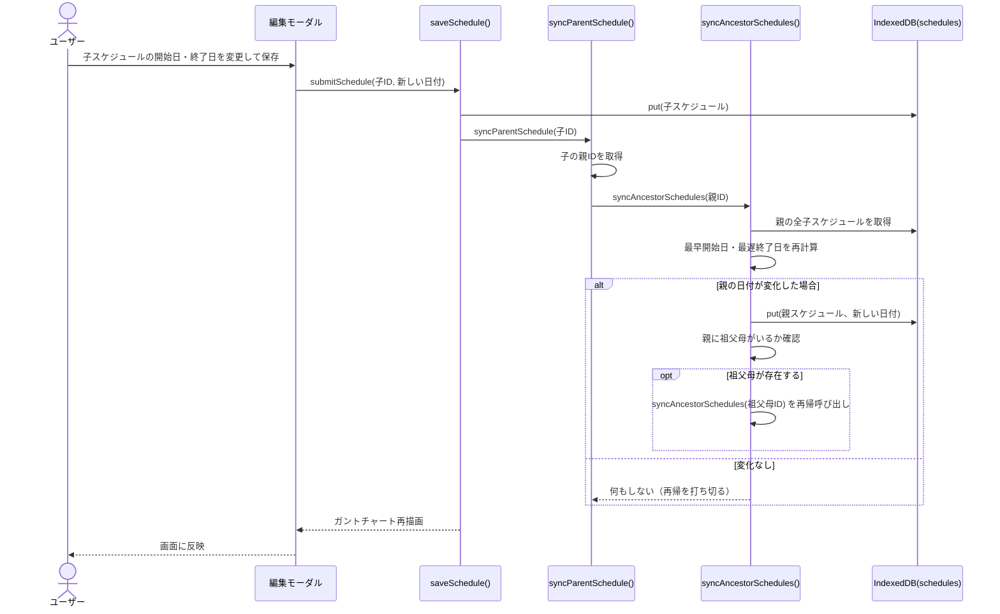
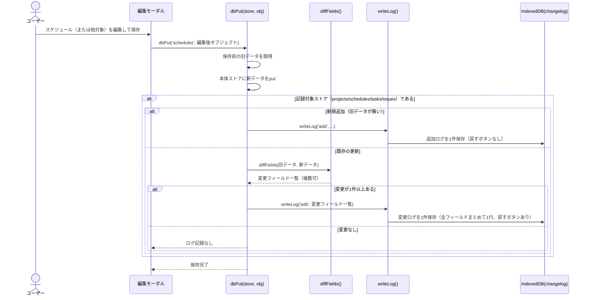
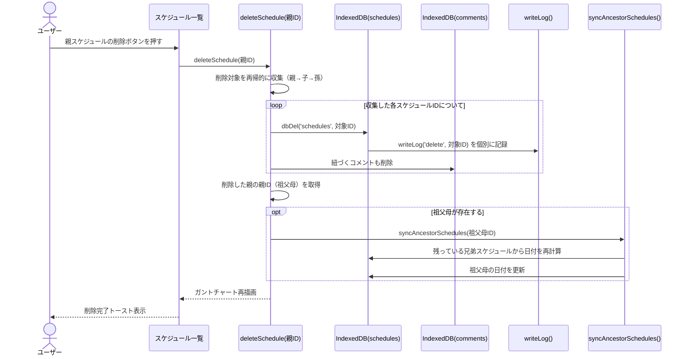
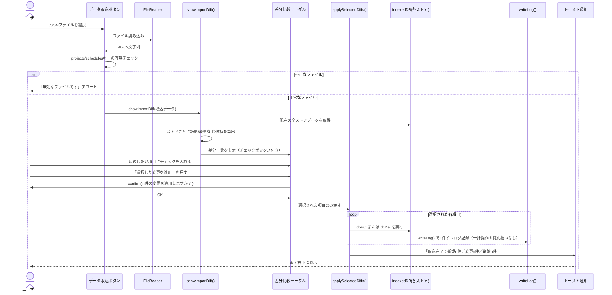
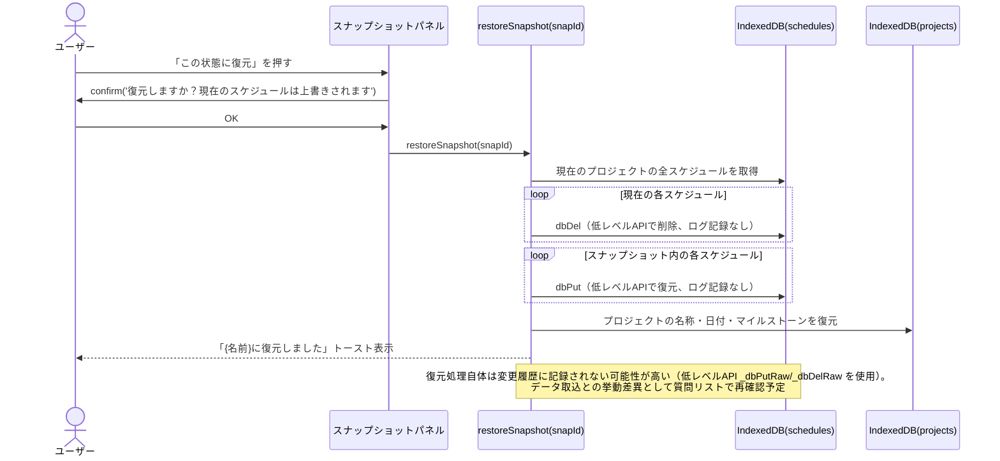

# シーケンス図集

基本設計書で確定した仕様のうち、処理の流れが複雑なものをシーケンス図にしています。Mermaid記法なので、対応するビューア（VSCode拡張、GitHub、Mermaid Live Editor等）でそのまま表示できます。

---

## 1. 日付の親子連動（子の変更→親へ伝播）

子スケジュールの日付を変更したときに、親・祖父母まで日付が伝播する流れです。

---

## 2. 変更履歴（changelog）の記録

スケジュール・タスク・プロジェクトを保存/削除するたびに、変更履歴が1件ずつ記録される流れです。

---

## 3. 親スケジュール削除（カスケード削除とログ）

親を削除すると、子・孫も再帰的に削除され、それぞれ個別にログが記録される流れです。

---

## 4. データインポート（差分適用）

JSONファイルを取り込み、選択した差分だけを反映する流れです。

---

## 5. スナップショット復元

保存済みスナップショットから、プロジェクトの状態を復元する流れです。

**補足**：スナップショット復元は`_dbPutRaw` / `_dbDelRaw`という「ログを記録しない低レベルAPI」を使っている可能性があり、これは「4. データインポート」で確認した「一括処理でも1件ずつログが記録される」という挙動と矛盾するかもしれません。この点は質問リストに追記して再確認することをお勧めします。
